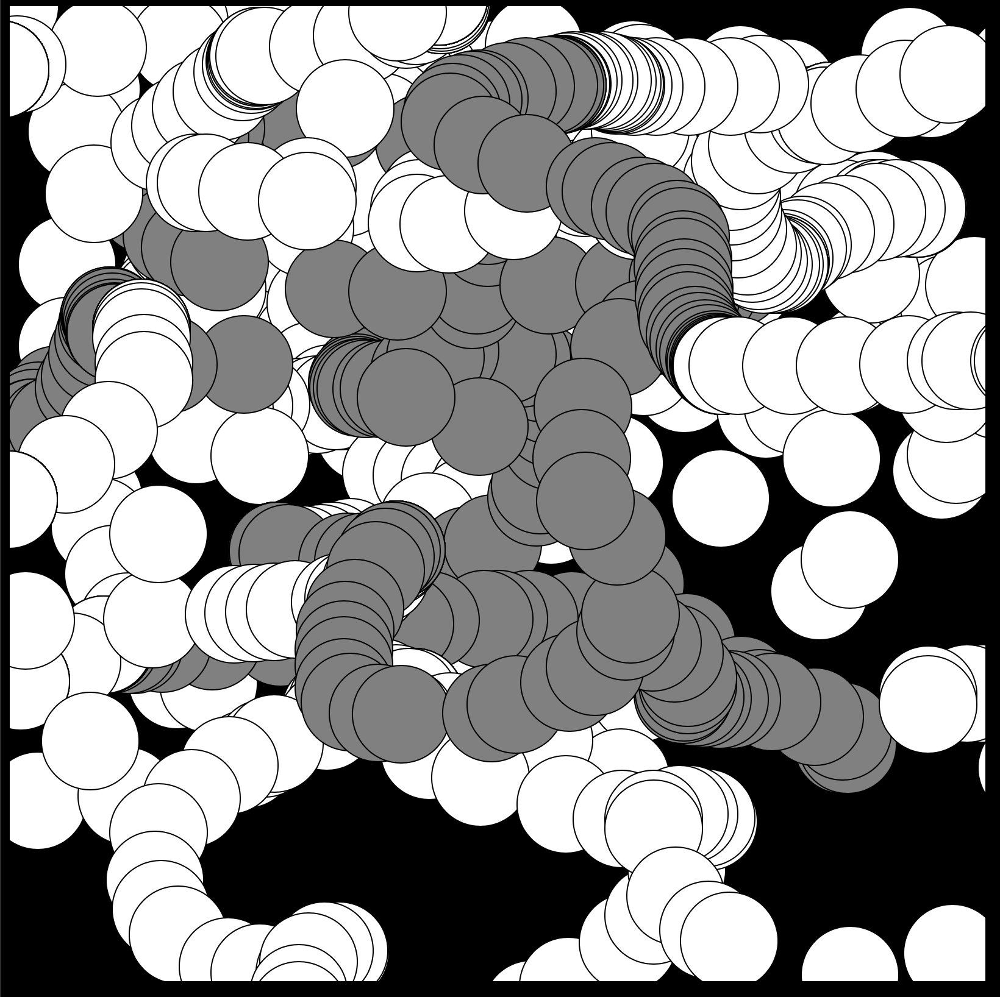
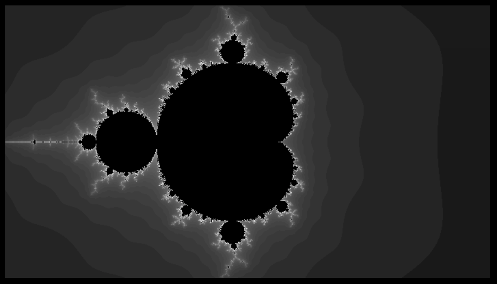

## p5.js

Processing.js has been replaced with [p5.js](https://p5js.org/).  According to the [processing-js repo](https://github.com/processing-js/processing-js):

>With the development of p5js and the API advances in Processing itself, as well as Processing.js itself having been in maintenance mode for quite a few years now, this project has been archived as of December 2018.

To create p5.js apps, p5.js (or the compressed p5.min.js) is needed. These files are available at <https://p5js.org/download/>.

Put the .js file(s) in a folder.  Then, create an .html file in the same folder with the following contents. The .html file needs to be created/edited with a plain text editor such as Atom, Visual Studio Code, etc.

```
<!doctype html>
<html>
  <head>
    <meta charset="utf-8">
    <title>p5.js test1</title>
    
    <style type="text/css">
		body{ background-color: black; }
    </style>
    <script src="p5.js"></script>
  </head>
  <body>
    <script>
		function setup() {
		  createCanvas(800, 800);
		}

		function draw() {
		  if (mouseIsPressed) {
			fill(128);
		  } else {
			fill(255);
		  }
		  ellipse(mouseX, mouseY, 80, 80);
		}
    </script>
  </body>
</html>
```

The above is an HTML 5 document. The ```<script src="p5.js"></script>``` in the head of the web page loads the p5.js javascript file which contains the library of code to draw pictures.  If you use the compressed version, replace p5.js with p5.min.js.

In the body is a ```<script></script>``` block that contains two javascript functions: ```setup()``` and ```draw()```. ```setup()``` is called by code in p5.js to do the setup.  In the example code, it is where the canvas of 800 x 800 is created using ```createCanvas(800, 800)```.  The canvas is where the picture is drawn. The ```draw()``` function is where code is placed to draw the picture. In the case of the draw() function shown, the state of the mouse button is used  to set the fill color (for filled objects that are drawn after it is set). The location of the mouse cursor is used to draw 80 x 80 ellipses (circles) with the fill color.

Open the .html file in a browser. Once it is loaded the browser will execute the javascript and draw a picture like the following. The html file is also available in [example1.html](example1.html).



The reference for p5.js is at <https://p5js.org/reference/>

Getting started with p5.js is at <https://p5js.org/get-started/>

Examples using p5.js are at <https://p5js.org/examples/>

The following image was created using the scripts shown in the html document below. It takes some time for the image to appear. This image requires a lot of computations to create it. If nothing appear immediately...wait. This is [The Mandelbrot Set example](https://p5js.org/examples/simulate-the-mandelbrot-set.html) in the examples provided on the p5.js web site. The following html is also available in [mandelbrot.html](mandelbrot.html) in this repository.

Notice the ```noLoop();``` in ```setup()```.  This causes is to call draw() once since the image is static. In the above example it needs to loop to draw based on moving the mouse.  Here is an another example that is animated are requires looping: <https://p5js.org/examples/simulate-flocking.html>



```
<!doctype html>
<html>
  <head>
    <meta charset="utf-8">
    <title>p5.js test1</title>
    
    <style type="text/css">
		body{ background-color: black; }
    </style>
    <script src="p5.js"></script>
  </head>
  <body>
    <script>

		function setup() {
		  createCanvas(710, 400);
		  pixelDensity(1);
		  noLoop();
		}

		function draw() {
		  background(0);

		  // Establish a range of values on the complex plane
		  // A different range will allow us to "zoom" in or out on the fractal

		  // It all starts with the width, try higher or lower values
		  const w = 4;
		  const h = (w * height) / width;

		  // Start at negative half the width and height
		  const xmin = -w/2;
		  const ymin = -h/2;

		  // Make sure we can write to the pixels[] array.
		  // Only need to do this once since we don't do any other drawing.
		  loadPixels();

		  // Maximum number of iterations for each point on the complex plane
		  const maxiterations = 100;

		  // x goes from xmin to xmax
		  const xmax = xmin + w;
		  // y goes from ymin to ymax
		  const ymax = ymin + h;

		  // Calculate amount we increment x,y for each pixel
		  const dx = (xmax - xmin) / (width);
		  const dy = (ymax - ymin) / (height);

		  // Start y
		  let y = ymin;
		  for (let j = 0; j < height; j++) {
			// Start x
			let x = xmin;
			for (let i = 0; i < width; i++) {

			  // Now we test, as we iterate z = z^2 + cm does z tend towards infinity?
			  let a = x;
			  let b = y;
			  let n = 0;
			  while (n < maxiterations) {
				const aa = a * a;
				const bb = b * b;
				const twoab = 2.0 * a * b;
				a = aa - bb + x;
				b = twoab + y;
				// Infinty in our finite world is simple, let's just consider it 16
				if (dist(aa, bb, 0, 0) > 16) {
				  break;  // Bail
				}
				n++;
			  }

			  // We color each pixel based on how long it takes to get to infinity
			  // If we never got there, let's pick the color black
			  const pix = (i+j*width)*4;
			  const norm = map(n, 0, maxiterations, 0, 1);
			  let bright = map(sqrt(norm), 0, 1, 0, 255);
			  if (n == maxiterations) {
				bright = 0;
			  } else {
				// Gosh, we could make fancy colors here if we wanted
				pixels[pix + 0] = bright;
				pixels[pix + 1] = bright;
				pixels[pix + 2] = bright;
				pixels[pix + 3] = 255;
			  }
			  x += dx;
			}
			y += dy;
		  }
		  updatePixels();
		}

    </script>
  </body>
</html>

```

It is possible to draw an image and then save it to scalable vector graphics (SVG). Check out <https://github.com/zenozeng/p5.js-svg> and <https://editor.p5js.org/dannyrozin/sketches/r1djoVow7>. The javascript library to support saving svg files is p5.svg.js and is available at <https://github.com/zenozeng/p5.js-svg/blob/master/dist/p5.svg.js> and is also in the repository as [p5.svg.js](p5.svg.js).

The following creates an svg of the drawn image. The svg file is named *wave.svg* and was put in the **Downloads folder** on my macOS computer when I loaded the page.

```
<!doctype html>
<html>
  <head>
    <meta charset="utf-8">
    <title>save svg</title>
    
    <style type="text/css">
		body{ background-color: white; }
    </style>
    <script src="p5.js"></script>
    <script src="p5.svg.js"></script>
  </head>
  <body>
    <script>
		function setup() {
			createCanvas(600, 200, SVG); // Create SVG Canvas
			strokeWeight(2);
			stroke('#ED225D');
		}

		function draw() {
			var x = frameCount / 100;
			var y = sin(x * PI * 2);
			line(x * width, height * 0.5,
				 x * width, y * height / 2 + height * 0.5);
			if (frameCount > 100) {
				noLoop();
				save("wave.svg");
			}
		}

    </script>
    
  </body>
</html>
```

The following is a link to the svg image that was created: <a href='wave.svg' target='_blank'>wave.svg</a>.

That file contains the following svg statements.

```
<svg version="1.1" xmlns="http://www.w3.org/2000/svg" xmlns:xlink="http://www.w3.org/1999/xlink" width="600" height="200" viewBox="0 0 600 200"><defs/><g/><g transform="scale(1,1) scale(1,1)"><path fill="none" stroke="rgb(237,34,93)" paint-order="fill stroke markers" d=" M 6 100 L 6 106.27905195293134" stroke-opacity="1" stroke-linecap="round" stroke-miterlimit="10" stroke-width="2"/><g transform="scale(1,1)"><path fill="none" stroke="rgb(237,34,93)" paint-order="fill stroke markers" d=" M 12 100 L 12 112.53332335643043" stroke-opacity="1" stroke-linecap="round" stroke-miterlimit="10" stroke-width="2"/><g transform="scale(1,1)"><path fill="none" stroke="rgb(237,34,93)" paint-order="fill stroke markers" d=" M 18 100 L 18 118.73813145857247" stroke-opacity="1" stroke-linecap="round" stroke-miterlimit="10" stroke-width="2"/><g transform="scale(1,1)"><path fill="none" stroke="rgb(237,34,93)" paint-order="fill stroke markers" d=" M 24 100 L 24 124.86898871648548" stroke-opacity="1" stroke-linecap="round" stroke-miterlimit="10" stroke-width="2"/><g transform="scale(1,1)"><path fill="none" stroke="rgb(237,34,93)" paint-order="fill stroke markers" d=" M 30 100 L 30 130.90169943749473" stroke-opacity="1" stroke-linecap="round" stroke-miterlimit="10" stroke-width="2"/><g transform="scale(1,1)"><path fill="none" stroke="rgb(237,34,93)" paint-order="fill stroke markers" d=" M 36 100 L 36 136.8124552684678" stroke-opacity="1" stroke-linecap="round" stroke-miterlimit="10" stroke-width="2"/><g transform="scale(1,1)"><path fill="none" stroke="rgb(237,34,93)" paint-order="fill stroke markers" d=" M 42.00000000000001 100 L 42.00000000000001 142.57792915650728" stroke-opacity="1" stroke-linecap="round" stroke-miterlimit="10" stroke-width="2"/><g transform="scale(1,1)"><path fill="none" stroke="rgb(237,34,93)" paint-order="fill stroke markers" d=" M 48 100 L 48 148.17536741017153" stroke-opacity="1" stroke-linecap="round" stroke-miterlimit="10" stroke-width="2"/><g transform="scale(1,1)"><path fill="none" stroke="rgb(237,34,93)" paint-order="fill stroke markers" d=" M 54 100 L 54 153.58267949789968" stroke-opacity="1" stroke-linecap="round" stroke-miterlimit="10" stroke-width="2"/><g transform="scale(1,1)"><path fill="none" stroke="rgb(237,34,93)" paint-order="fill stroke markers" d=" M 60 100 L 60 158.77852522924732" stroke-opacity="1" stroke-linecap="round" stroke-miterlimit="10" stroke-width="2"/><g transform="scale(1,1)"><path fill="none" stroke="rgb(237,34,93)" paint-order="fill stroke markers" d=" M 66 100 L 66 163.74239897486896" stroke-opacity="1" stroke-linecap="round" stroke-miterlimit="10" stroke-width="2"/><g transform="scale(1,1)"><path fill="none" stroke="rgb(237,34,93)" paint-order="fill stroke markers" d=" M 72 100 L 72 168.45471059286888" stroke-opacity="1" stroke-linecap="round" stroke-miterlimit="10" stroke-width="2"/><g transform="scale(1,1)"><path fill="none" stroke="rgb(237,34,93)" paint-order="fill stroke markers" d=" M 78 100 L 78 172.89686274214114" stroke-opacity="1" stroke-linecap="round" stroke-miterlimit="10" stroke-width="2"/><g transform="scale(1,1)"><path fill="none" stroke="rgb(237,34,93)" paint-order="fill stroke markers" d=" M 84.00000000000001 100 L 84.00000000000001 177.05132427757894" stroke-opacity="1" stroke-linecap="round" stroke-miterlimit="10" stroke-width="2"/><g transform="scale(1,1)"><path fill="none" stroke="rgb(237,34,93)" paint-order="fill stroke markers" d=" M 90 100 L 90 180.90169943749473" stroke-opacity="1" stroke-linecap="round" stroke-miterlimit="10" stroke-width="2"/><g transform="scale(1,1)"><path fill="none" stroke="rgb(237,34,93)" paint-order="fill stroke markers" d=" M 96 100 L 96 184.4327925502015" stroke-opacity="1" stroke-linecap="round" stroke-miterlimit="10" stroke-width="2"/><g transform="scale(1,1)"><path fill="none" stroke="rgb(237,34,93)" paint-order="fill stroke markers" d=" M 102.00000000000001 100 L 102.00000000000001 187.63066800438637" stroke-opacity="1" stroke-linecap="round" stroke-miterlimit="10" stroke-width="2"/><g transform="scale(1,1)"><path fill="none" stroke="rgb(237,34,93)" paint-order="fill stroke markers" d=" M 108 100 L 108 190.48270524660194" stroke-opacity="1" stroke-linecap="round" stroke-miterlimit="10" stroke-width="2"/><g transform="scale(1,1)"><path fill="none" stroke="rgb(237,34,93)" paint-order="fill stroke markers" d=" M 114 100 L 114 192.97764858882513" stroke-opacity="1" stroke-linecap="round" stroke-miterlimit="10" stroke-width="2"/><g transform="scale(1,1)"><path fill="none" stroke="rgb(237,34,93)" paint-order="fill stroke markers" d=" M 120 100 L 120 195.10565162951536" stroke-opacity="1" stroke-linecap="round" stroke-miterlimit="10" stroke-width="2"/><g transform="scale(1,1)"><path fill="none" stroke="rgb(237,34,93)" paint-order="fill stroke markers" d=" M 126 100 L 126 196.85831611286312" stroke-opacity="1" stroke-linecap="round" stroke-miterlimit="10" stroke-width="2"/><g transform="scale(1,1)"><path fill="none" stroke="rgb(237,34,93)" paint-order="fill stroke markers" d=" M 132 100 L 132 198.22872507286885" stroke-opacity="1" stroke-linecap="round" stroke-miterlimit="10" stroke-width="2"/><g transform="scale(1,1)"><path fill="none" stroke="rgb(237,34,93)" paint-order="fill stroke markers" d=" M 138 100 L 138 199.21147013144778" stroke-opacity="1" stroke-linecap="round" stroke-miterlimit="10" stroke-width="2"/><g transform="scale(1,1)"><path fill="none" stroke="rgb(237,34,93)" paint-order="fill stroke markers" d=" M 144 100 L 144 199.80267284282715" stroke-opacity="1" stroke-linecap="round" stroke-miterlimit="10" stroke-width="2"/><g transform="scale(1,1)"><path fill="none" stroke="rgb(237,34,93)" paint-order="fill stroke markers" d=" M 150 100 L 150 200" stroke-opacity="1" stroke-linecap="round" stroke-miterlimit="10" stroke-width="2"/><g transform="scale(1,1)"><path fill="none" stroke="rgb(237,34,93)" paint-order="fill stroke markers" d=" M 156 100 L 156 199.80267284282715" stroke-opacity="1" stroke-linecap="round" stroke-miterlimit="10" stroke-width="2"/><g transform="scale(1,1)"><path fill="none" stroke="rgb(237,34,93)" paint-order="fill stroke markers" d=" M 162 100 L 162 199.21147013144778" stroke-opacity="1" stroke-linecap="round" stroke-miterlimit="10" stroke-width="2"/><g transform="scale(1,1)"><path fill="none" stroke="rgb(237,34,93)" paint-order="fill stroke markers" d=" M 168.00000000000003 100 L 168.00000000000003 198.22872507286885" stroke-opacity="1" stroke-linecap="round" stroke-miterlimit="10" stroke-width="2"/><g transform="scale(1,1)"><path fill="none" stroke="rgb(237,34,93)" paint-order="fill stroke markers" d=" M 174 100 L 174 196.85831611286312" stroke-opacity="1" stroke-linecap="round" stroke-miterlimit="10" stroke-width="2"/><g transform="scale(1,1)"><path fill="none" stroke="rgb(237,34,93)" paint-order="fill stroke markers" d=" M 180 100 L 180 195.10565162951536" stroke-opacity="1" stroke-linecap="round" stroke-miterlimit="10" stroke-width="2"/><g transform="scale(1,1)"><path fill="none" stroke="rgb(237,34,93)" paint-order="fill stroke markers" d=" M 186 100 L 186 192.97764858882513" stroke-opacity="1" stroke-linecap="round" stroke-miterlimit="10" stroke-width="2"/><g transform="scale(1,1)"><path fill="none" stroke="rgb(237,34,93)" paint-order="fill stroke markers" d=" M 192 100 L 192 190.48270524660194" stroke-opacity="1" stroke-linecap="round" stroke-miterlimit="10" stroke-width="2"/><g transform="scale(1,1)"><path fill="none" stroke="rgb(237,34,93)" paint-order="fill stroke markers" d=" M 198 100 L 198 187.63066800438634" stroke-opacity="1" stroke-linecap="round" stroke-miterlimit="10" stroke-width="2"/><g transform="scale(1,1)"><path fill="none" stroke="rgb(237,34,93)" paint-order="fill stroke markers" d=" M 204.00000000000003 100 L 204.00000000000003 184.4327925502015" stroke-opacity="1" stroke-linecap="round" stroke-miterlimit="10" stroke-width="2"/><g transform="scale(1,1)"><path fill="none" stroke="rgb(237,34,93)" paint-order="fill stroke markers" d=" M 210 100 L 210 180.90169943749476" stroke-opacity="1" stroke-linecap="round" stroke-miterlimit="10" stroke-width="2"/><g transform="scale(1,1)"><path fill="none" stroke="rgb(237,34,93)" paint-order="fill stroke markers" d=" M 216 100 L 216 177.05132427757894" stroke-opacity="1" stroke-linecap="round" stroke-miterlimit="10" stroke-width="2"/><g transform="scale(1,1)"><path fill="none" stroke="rgb(237,34,93)" paint-order="fill stroke markers" d=" M 222 100 L 222 172.89686274214114" stroke-opacity="1" stroke-linecap="round" stroke-miterlimit="10" stroke-width="2"/><g transform="scale(1,1)"><path fill="none" stroke="rgb(237,34,93)" paint-order="fill stroke markers" d=" M 228 100 L 228 168.45471059286888" stroke-opacity="1" stroke-linecap="round" stroke-miterlimit="10" stroke-width="2"/><g transform="scale(1,1)"><path fill="none" stroke="rgb(237,34,93)" paint-order="fill stroke markers" d=" M 234 100 L 234 163.742398974869" stroke-opacity="1" stroke-linecap="round" stroke-miterlimit="10" stroke-width="2"/><g transform="scale(1,1)"><path fill="none" stroke="rgb(237,34,93)" paint-order="fill stroke markers" d=" M 240 100 L 240 158.77852522924732" stroke-opacity="1" stroke-linecap="round" stroke-miterlimit="10" stroke-width="2"/><g transform="scale(1,1)"><path fill="none" stroke="rgb(237,34,93)" paint-order="fill stroke markers" d=" M 245.99999999999997 100 L 245.99999999999997 153.5826794978997" stroke-opacity="1" stroke-linecap="round" stroke-miterlimit="10" stroke-width="2"/><g transform="scale(1,1)"><path fill="none" stroke="rgb(237,34,93)" paint-order="fill stroke markers" d=" M 252 100 L 252 148.17536741017156" stroke-opacity="1" stroke-linecap="round" stroke-miterlimit="10" stroke-width="2"/><g transform="scale(1,1)"><path fill="none" stroke="rgb(237,34,93)" paint-order="fill stroke markers" d=" M 258 100 L 258 142.57792915650728" stroke-opacity="1" stroke-linecap="round" stroke-miterlimit="10" stroke-width="2"/><g transform="scale(1,1)"><path fill="none" stroke="rgb(237,34,93)" paint-order="fill stroke markers" d=" M 264 100 L 264 136.81245526846783" stroke-opacity="1" stroke-linecap="round" stroke-miterlimit="10" stroke-width="2"/><g transform="scale(1,1)"><path fill="none" stroke="rgb(237,34,93)" paint-order="fill stroke markers" d=" M 270 100 L 270 130.90169943749476" stroke-opacity="1" stroke-linecap="round" stroke-miterlimit="10" stroke-width="2"/><g transform="scale(1,1)"><path fill="none" stroke="rgb(237,34,93)" paint-order="fill stroke markers" d=" M 276 100 L 276 124.86898871648548" stroke-opacity="1" stroke-linecap="round" stroke-miterlimit="10" stroke-width="2"/><g transform="scale(1,1)"><path fill="none" stroke="rgb(237,34,93)" paint-order="fill stroke markers" d=" M 282 100 L 282 118.7381314585725" stroke-opacity="1" stroke-linecap="round" stroke-miterlimit="10" stroke-width="2"/><g transform="scale(1,1)"><path fill="none" stroke="rgb(237,34,93)" paint-order="fill stroke markers" d=" M 288 100 L 288 112.53332335643046" stroke-opacity="1" stroke-linecap="round" stroke-miterlimit="10" stroke-width="2"/><g transform="scale(1,1)"><path fill="none" stroke="rgb(237,34,93)" paint-order="fill stroke markers" d=" M 294 100 L 294 106.27905195293135" stroke-opacity="1" stroke-linecap="round" stroke-miterlimit="10" stroke-width="2"/><g transform="scale(1,1)"><path fill="none" stroke="rgb(237,34,93)" paint-order="fill stroke markers" d=" M 300 100 L 300 100.00000000000001" stroke-opacity="1" stroke-linecap="round" stroke-miterlimit="10" stroke-width="2"/><g transform="scale(1,1)"><path fill="none" stroke="rgb(237,34,93)" paint-order="fill stroke markers" d=" M 306 100 L 306 93.72094804706867" stroke-opacity="1" stroke-linecap="round" stroke-miterlimit="10" stroke-width="2"/><g transform="scale(1,1)"><path fill="none" stroke="rgb(237,34,93)" paint-order="fill stroke markers" d=" M 312 100 L 312 87.46667664356957" stroke-opacity="1" stroke-linecap="round" stroke-miterlimit="10" stroke-width="2"/><g transform="scale(1,1)"><path fill="none" stroke="rgb(237,34,93)" paint-order="fill stroke markers" d=" M 318 100 L 318 81.26186854142753" stroke-opacity="1" stroke-linecap="round" stroke-miterlimit="10" stroke-width="2"/><g transform="scale(1,1)"><path fill="none" stroke="rgb(237,34,93)" paint-order="fill stroke markers" d=" M 324 100 L 324 75.1310112835145" stroke-opacity="1" stroke-linecap="round" stroke-miterlimit="10" stroke-width="2"/><g transform="scale(1,1)"><path fill="none" stroke="rgb(237,34,93)" paint-order="fill stroke markers" d=" M 330 100 L 330 69.09830056250523" stroke-opacity="1" stroke-linecap="round" stroke-miterlimit="10" stroke-width="2"/><g transform="scale(1,1)"><path fill="none" stroke="rgb(237,34,93)" paint-order="fill stroke markers" d=" M 336.00000000000006 100 L 336.00000000000006 63.187544731532164" stroke-opacity="1" stroke-linecap="round" stroke-miterlimit="10" stroke-width="2"/><g transform="scale(1,1)"><path fill="none" stroke="rgb(237,34,93)" paint-order="fill stroke markers" d=" M 341.99999999999994 100 L 341.99999999999994 57.422070843492776" stroke-opacity="1" stroke-linecap="round" stroke-miterlimit="10" stroke-width="2"/><g transform="scale(1,1)"><path fill="none" stroke="rgb(237,34,93)" paint-order="fill stroke markers" d=" M 348 100 L 348 51.824632589828504" stroke-opacity="1" stroke-linecap="round" stroke-miterlimit="10" stroke-width="2"/><g transform="scale(1,1)"><path fill="none" stroke="rgb(237,34,93)" paint-order="fill stroke markers" d=" M 354 100 L 354 46.41732050210036" stroke-opacity="1" stroke-linecap="round" stroke-miterlimit="10" stroke-width="2"/><g transform="scale(1,1)"><path fill="none" stroke="rgb(237,34,93)" paint-order="fill stroke markers" d=" M 360 100 L 360 41.2214747707527" stroke-opacity="1" stroke-linecap="round" stroke-miterlimit="10" stroke-width="2"/><g transform="scale(1,1)"><path fill="none" stroke="rgb(237,34,93)" paint-order="fill stroke markers" d=" M 366 100 L 366 36.25760102513104" stroke-opacity="1" stroke-linecap="round" stroke-miterlimit="10" stroke-width="2"/><g transform="scale(1,1)"><path fill="none" stroke="rgb(237,34,93)" paint-order="fill stroke markers" d=" M 372 100 L 372 31.545289407131122" stroke-opacity="1" stroke-linecap="round" stroke-miterlimit="10" stroke-width="2"/><g transform="scale(1,1)"><path fill="none" stroke="rgb(237,34,93)" paint-order="fill stroke markers" d=" M 378 100 L 378 27.10313725785886" stroke-opacity="1" stroke-linecap="round" stroke-miterlimit="10" stroke-width="2"/><g transform="scale(1,1)"><path fill="none" stroke="rgb(237,34,93)" paint-order="fill stroke markers" d=" M 384 100 L 384 22.948675722421058" stroke-opacity="1" stroke-linecap="round" stroke-miterlimit="10" stroke-width="2"/><g transform="scale(1,1)"><path fill="none" stroke="rgb(237,34,93)" paint-order="fill stroke markers" d=" M 390 100 L 390 19.098300562505273" stroke-opacity="1" stroke-linecap="round" stroke-miterlimit="10" stroke-width="2"/><g transform="scale(1,1)"><path fill="none" stroke="rgb(237,34,93)" paint-order="fill stroke markers" d=" M 396 100 L 396 15.567207449798474" stroke-opacity="1" stroke-linecap="round" stroke-miterlimit="10" stroke-width="2"/><g transform="scale(1,1)"><path fill="none" stroke="rgb(237,34,93)" paint-order="fill stroke markers" d=" M 402 100 L 402 12.369331995613635" stroke-opacity="1" stroke-linecap="round" stroke-miterlimit="10" stroke-width="2"/><g transform="scale(1,1)"><path fill="none" stroke="rgb(237,34,93)" paint-order="fill stroke markers" d=" M 408.00000000000006 100 L 408.00000000000006 9.51729475339802" stroke-opacity="1" stroke-linecap="round" stroke-miterlimit="10" stroke-width="2"/><g transform="scale(1,1)"><path fill="none" stroke="rgb(237,34,93)" paint-order="fill stroke markers" d=" M 413.99999999999994 100 L 413.99999999999994 7.022351411174881" stroke-opacity="1" stroke-linecap="round" stroke-miterlimit="10" stroke-width="2"/><g transform="scale(1,1)"><path fill="none" stroke="rgb(237,34,93)" paint-order="fill stroke markers" d=" M 420 100 L 420 4.89434837048465" stroke-opacity="1" stroke-linecap="round" stroke-miterlimit="10" stroke-width="2"/><g transform="scale(1,1)"><path fill="none" stroke="rgb(237,34,93)" paint-order="fill stroke markers" d=" M 426 100 L 426 3.1416838871369066" stroke-opacity="1" stroke-linecap="round" stroke-miterlimit="10" stroke-width="2"/><g transform="scale(1,1)"><path fill="none" stroke="rgb(237,34,93)" paint-order="fill stroke markers" d=" M 432 100 L 432 1.771274927131131" stroke-opacity="1" stroke-linecap="round" stroke-miterlimit="10" stroke-width="2"/><g transform="scale(1,1)"><path fill="none" stroke="rgb(237,34,93)" paint-order="fill stroke markers" d=" M 438 100 L 438 0.7885298685522173" stroke-opacity="1" stroke-linecap="round" stroke-miterlimit="10" stroke-width="2"/><g transform="scale(1,1)"><path fill="none" stroke="rgb(237,34,93)" paint-order="fill stroke markers" d=" M 444 100 L 444 0.19732715717285032" stroke-opacity="1" stroke-linecap="round" stroke-miterlimit="10" stroke-width="2"/><g transform="scale(1,1)"><path fill="none" stroke="rgb(237,34,93)" paint-order="fill stroke markers" d=" M 450 100 L 450 0" stroke-opacity="1" stroke-linecap="round" stroke-miterlimit="10" stroke-width="2"/><g transform="scale(1,1)"><path fill="none" stroke="rgb(237,34,93)" paint-order="fill stroke markers" d=" M 456 100 L 456 0.19732715717285032" stroke-opacity="1" stroke-linecap="round" stroke-miterlimit="10" stroke-width="2"/><g transform="scale(1,1)"><path fill="none" stroke="rgb(237,34,93)" paint-order="fill stroke markers" d=" M 462 100 L 462 0.7885298685522173" stroke-opacity="1" stroke-linecap="round" stroke-miterlimit="10" stroke-width="2"/><g transform="scale(1,1)"><path fill="none" stroke="rgb(237,34,93)" paint-order="fill stroke markers" d=" M 468 100 L 468 1.771274927131131" stroke-opacity="1" stroke-linecap="round" stroke-miterlimit="10" stroke-width="2"/><g transform="scale(1,1)"><path fill="none" stroke="rgb(237,34,93)" paint-order="fill stroke markers" d=" M 474 100 L 474 3.1416838871368924" stroke-opacity="1" stroke-linecap="round" stroke-miterlimit="10" stroke-width="2"/><g transform="scale(1,1)"><path fill="none" stroke="rgb(237,34,93)" paint-order="fill stroke markers" d=" M 480 100 L 480 4.894348370484636" stroke-opacity="1" stroke-linecap="round" stroke-miterlimit="10" stroke-width="2"/><g transform="scale(1,1)"><path fill="none" stroke="rgb(237,34,93)" paint-order="fill stroke markers" d=" M 486.00000000000006 100 L 486.00000000000006 7.022351411174881" stroke-opacity="1" stroke-linecap="round" stroke-miterlimit="10" stroke-width="2"/><g transform="scale(1,1)"><path fill="none" stroke="rgb(237,34,93)" paint-order="fill stroke markers" d=" M 491.99999999999994 100 L 491.99999999999994 9.517294753398005" stroke-opacity="1" stroke-linecap="round" stroke-miterlimit="10" stroke-width="2"/><g transform="scale(1,1)"><path fill="none" stroke="rgb(237,34,93)" paint-order="fill stroke markers" d=" M 498 100 L 498 12.36933199561362" stroke-opacity="1" stroke-linecap="round" stroke-miterlimit="10" stroke-width="2"/><g transform="scale(1,1)"><path fill="none" stroke="rgb(237,34,93)" paint-order="fill stroke markers" d=" M 504 100 L 504 15.567207449798445" stroke-opacity="1" stroke-linecap="round" stroke-miterlimit="10" stroke-width="2"/><g transform="scale(1,1)"><path fill="none" stroke="rgb(237,34,93)" paint-order="fill stroke markers" d=" M 510 100 L 510 19.098300562505244" stroke-opacity="1" stroke-linecap="round" stroke-miterlimit="10" stroke-width="2"/><g transform="scale(1,1)"><path fill="none" stroke="rgb(237,34,93)" paint-order="fill stroke markers" d=" M 516 100 L 516 22.948675722421044" stroke-opacity="1" stroke-linecap="round" stroke-miterlimit="10" stroke-width="2"/><g transform="scale(1,1)"><path fill="none" stroke="rgb(237,34,93)" paint-order="fill stroke markers" d=" M 522 100 L 522 27.103137257858847" stroke-opacity="1" stroke-linecap="round" stroke-miterlimit="10" stroke-width="2"/><g transform="scale(1,1)"><path fill="none" stroke="rgb(237,34,93)" paint-order="fill stroke markers" d=" M 528 100 L 528 31.545289407131108" stroke-opacity="1" stroke-linecap="round" stroke-miterlimit="10" stroke-width="2"/><g transform="scale(1,1)"><path fill="none" stroke="rgb(237,34,93)" paint-order="fill stroke markers" d=" M 534 100 L 534 36.25760102513104" stroke-opacity="1" stroke-linecap="round" stroke-miterlimit="10" stroke-width="2"/><g transform="scale(1,1)"><path fill="none" stroke="rgb(237,34,93)" paint-order="fill stroke markers" d=" M 540 100 L 540 41.22147477075268" stroke-opacity="1" stroke-linecap="round" stroke-miterlimit="10" stroke-width="2"/><g transform="scale(1,1)"><path fill="none" stroke="rgb(237,34,93)" paint-order="fill stroke markers" d=" M 546 100 L 546 46.41732050210037" stroke-opacity="1" stroke-linecap="round" stroke-miterlimit="10" stroke-width="2"/><g transform="scale(1,1)"><path fill="none" stroke="rgb(237,34,93)" paint-order="fill stroke markers" d=" M 552 100 L 552 51.82463258982847" stroke-opacity="1" stroke-linecap="round" stroke-miterlimit="10" stroke-width="2"/><g transform="scale(1,1)"><path fill="none" stroke="rgb(237,34,93)" paint-order="fill stroke markers" d=" M 558 100 L 558 57.422070843492776" stroke-opacity="1" stroke-linecap="round" stroke-miterlimit="10" stroke-width="2"/><g transform="scale(1,1)"><path fill="none" stroke="rgb(237,34,93)" paint-order="fill stroke markers" d=" M 564 100 L 564 63.187544731532135" stroke-opacity="1" stroke-linecap="round" stroke-miterlimit="10" stroke-width="2"/><g transform="scale(1,1)"><path fill="none" stroke="rgb(237,34,93)" paint-order="fill stroke markers" d=" M 570 100 L 570 69.09830056250524" stroke-opacity="1" stroke-linecap="round" stroke-miterlimit="10" stroke-width="2"/><g transform="scale(1,1)"><path fill="none" stroke="rgb(237,34,93)" paint-order="fill stroke markers" d=" M 576 100 L 576 75.13101128351447" stroke-opacity="1" stroke-linecap="round" stroke-miterlimit="10" stroke-width="2"/><g transform="scale(1,1)"><path fill="none" stroke="rgb(237,34,93)" paint-order="fill stroke markers" d=" M 582 100 L 582 81.26186854142753" stroke-opacity="1" stroke-linecap="round" stroke-miterlimit="10" stroke-width="2"/><g transform="scale(1,1)"><path fill="none" stroke="rgb(237,34,93)" paint-order="fill stroke markers" d=" M 588 100 L 588 87.46667664356953" stroke-opacity="1" stroke-linecap="round" stroke-miterlimit="10" stroke-width="2"/><g transform="scale(1,1)"><path fill="none" stroke="rgb(237,34,93)" paint-order="fill stroke markers" d=" M 594 100 L 594 93.72094804706867" stroke-opacity="1" stroke-linecap="round" stroke-miterlimit="10" stroke-width="2"/><g transform="scale(1,1)"><path fill="none" stroke="rgb(237,34,93)" paint-order="fill stroke markers" d=" M 600 100 L 600 99.99999999999997" stroke-opacity="1" stroke-linecap="round" stroke-miterlimit="10" stroke-width="2"/><g transform="scale(1,1)"><path fill="none" stroke="rgb(237,34,93)" paint-order="fill stroke markers" d=" M 606 100 L 606 106.27905195293127" stroke-opacity="1" stroke-linecap="round" stroke-miterlimit="10" stroke-width="2"/></g></g></g></g></g></g></g></g></g></g></g></g></g></g></g></g></g></g></g></g></g></g></g></g></g></g></g></g></g></g></g></g></g></g></g></g></g></g></g></g></g></g></g></g></g></g></g></g></g></g></g></g></g></g></g></g></g></g></g></g></g></g></g></g></g></g></g></g></g></g></g></g></g></g></g></g></g></g></g></g></g></g></g></g></g></g></g></g></g></g></g></g></g></g></g></g></g></g></g></g></g></svg>
```

>&copy; 2020 [Dale Musser](https://dalemusser.com). All rights reserved.<br /><br />
>This document is provided with the materials for an educational course and are meant for personal use by the student while participating in the course.


